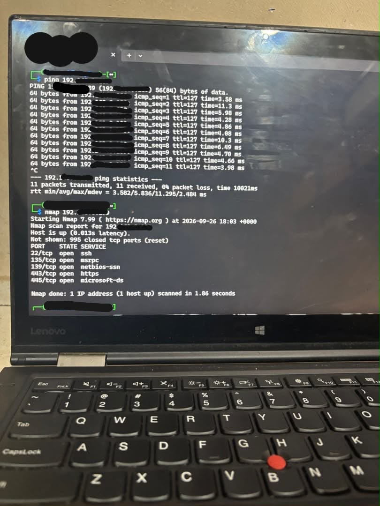
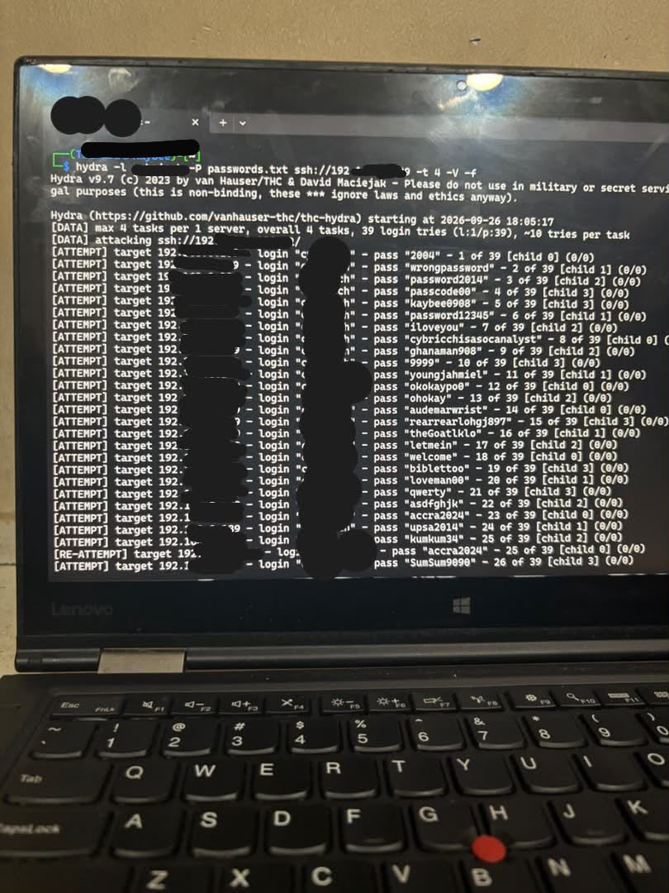
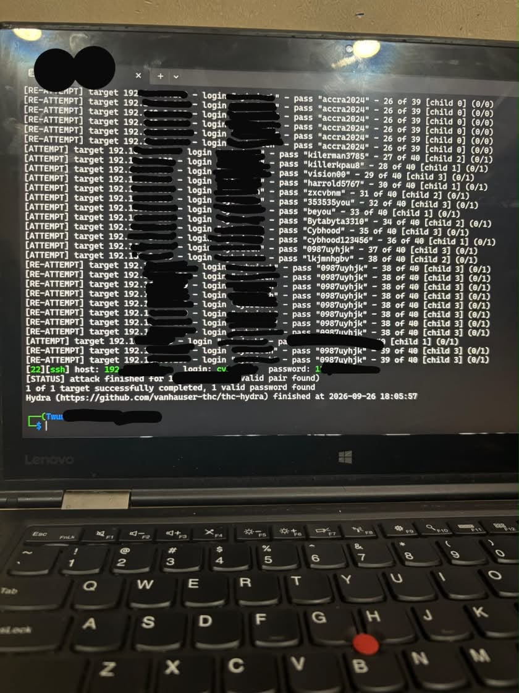
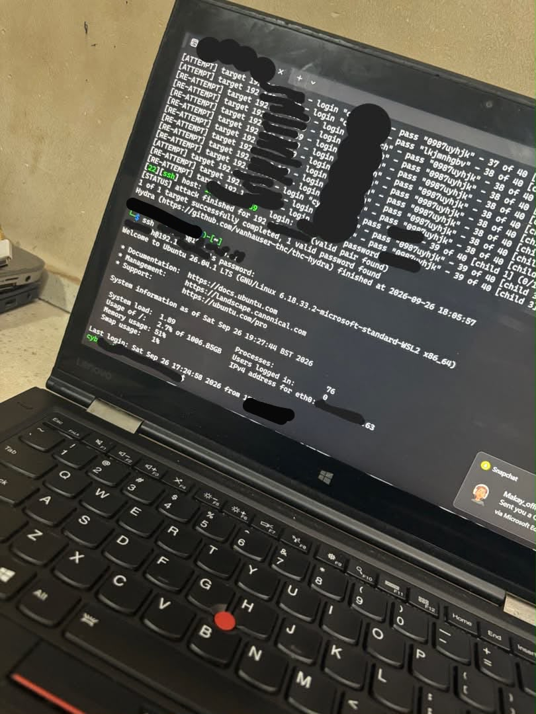
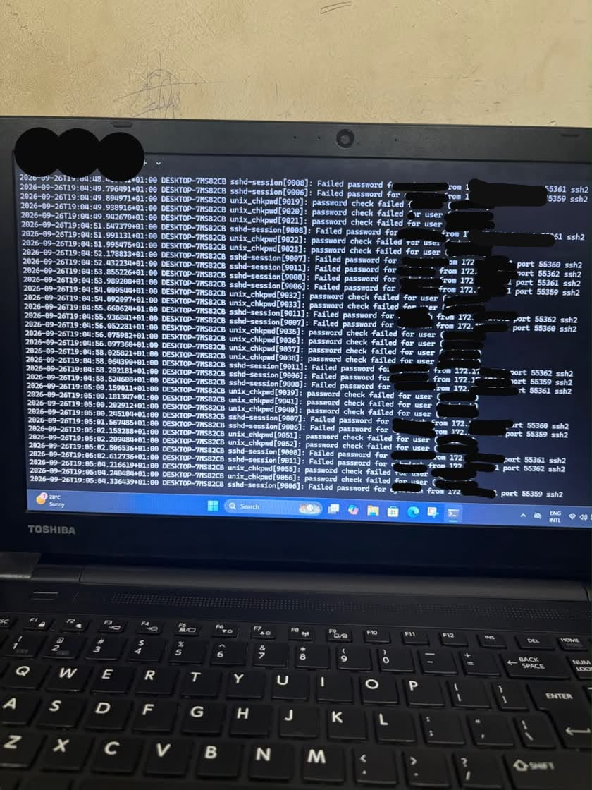

# Mini SOC lab: SSH-Brute-Force-Attack-Detection-and-Mitigation
I built a mini SOC lab to simulate a real-world attack. 
I used two laptops on the same network, 
one as attacker machine running Hydra for SSH brute-force
and the other as the victim(Ubuntu VM). The attack was detected in real-time
using Wazuh SIEM via auth.log monitoring, 
and successfully mitigated using iptables to block the attacker IP. 

##Lab Setup
1. Attacker: Kali Linux
2. Victim: Ubuntu VM
3. same Lan network

##Steps 

*Ping Test and Nmap:*
I ran a Ping test to see if the host is up and ran nmap port scan on the host IP to see open ports. 
**Results:** Host is up, port 22(ssh) is open

*Wazuh logging:*
I started Wazuh-agent to send alerts to SIEM dashboard.

*Attack:* Ran Hydra SSH brute-force against the Victim IP address and found the correct password. I used the correct password found by Hydra to gain access to the victim machine via SSH
**Results:** Hydra attacking, Hydra found password, [password found and SSH login successful 

*Detection:*
Checked the auth.log to see failed ssh login attempts from the attacker IP in real-time and also few successful logins from the Attacker IP after the numerous failed ones 
**Results:** Multiple failed login attempts from the Attacker IP and finally few Successful logins. Note: Few successful logins because I logged out of the host from the attacker machine and logged in back to confirm persistence access, not multiple brute-force hits

wazuh dashboard visualized the failed attempts. and the successful login 

*Mitigation:* Blocked attacker IP with iptables
